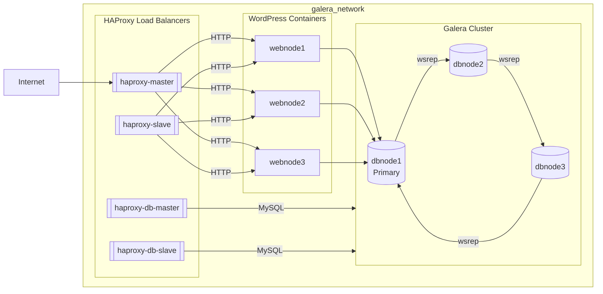

# Tarea #991 De la tarea #995 terminar de configurar la arquitectura completando el esquema de HA

#

## Composición de la Arquitectura de Alta Disponibilidad:

### **MariaDB (Galera Cluster)**

El clúster de bases de datos está compuesto por tres nodos (dbnode1, dbnode2, dbnode3), donde:
- **dbnode1** es el nodo primario.
- Todos los nodos están sincronizados utilizando el protocolo **wsrep** de **Galera**.

### **WordPress**

Existen tres contenedores de **WordPress**:
- **webnode1**, **webnode2**, **webnode3**.
- Cada nodo de WordPress se conecta a la base de datos MariaDB a través del nodo **dbnode1** dentro de la red **galera_network**.

### **HAProxy**

El sistema de balanceo de carga está compuesto por cuatro instancias de **HAProxy**:
1. **haproxy-master**: Balancea el tráfico **HTTP** entre los nodos de WordPress.
2. **haproxy-slave**: Actúa como respaldo del **haproxy-master**, balanceando también el tráfico **HTTP**.
3. **haproxy-db-master**: Balancea las conexiones **MySQL** entre los nodos del clúster de **MariaDB**.
4. **haproxy-db-slave**: Actúa como respaldo del **haproxy-db-master**, balanceando también las conexiones **MySQL**.

## Conexiones y Flujo de Datos

1. **Tráfico HTTP de los usuarios**:
   - Los usuarios acceden a **haproxy-master** o **haproxy-slave**.
   - Estos balanceadores de carga dirigen el tráfico hacia uno de los nodos de **WordPress** (webnode1, webnode2 o webnode3).

2. **Conexión de los nodos de WordPress a la base de datos**:
   - Los nodos de **WordPress** (wp1, wp2 y wp3) se conectan al nodo primario de **MariaDB (dbnode1)** a través de los balanceadores de carga **haproxy-db-master** y **haproxy-db-slave**.

3. **Balanceo de carga para las conexiones MySQL**:
   - **haproxy-db-master** y **haproxy-db-slave** gestionan el balanceo de las conexiones **MySQL** entre los nodos del clúster de **MariaDB**.

## Diagrama de la Arquitectura

## Herramientas de Prueba de Carga

- **Siege**
- **Apache Benchmark (ab)**

## Parámetros de la Prueba Siege

- **Usuarios simultáneos**: 100
- **Duración**: 5 minutos

---

## Resultados

### Siege

| Métrica                  | Valor     |
|--------------------------|-----------|
| Transacciones            | 18,412    |
| Tiempo transcurrido      | 299.84 s  |
| Transacciones por segundo| 61.41     |
| Tiempo de respuesta promedio | 1.58 s|
| Transacciones fallidas   | 0         |
| Concurrencia promedio    | 97.03     |
| Transferencia total      | 65.16 MB  |
| Transacción más larga    | 33.89 s   |

## Otra prueba
- **Usuarios simultáneos**: 200
- **Duración**: 5 minutos

## Parámetros de la Prueba Apache Benchmark
- **Requests**: 3000
- **Concurrencia**: 100

## Resultados

| Métrica                     | Valor            |
|-----------------------------|------------------|
| Solicitudes completadas     | 3000             |
| Tiempo total de prueba      | 90.55 s          |
| Solicitudes por segundo     | 33.13 req/sec    |
| Tiempo por solicitud (media)| 3018 ms          |
| Transferencia total         | 149.6 MB         |
| Transferencia por segundo   | 1613.11 KB/s     |
| Tiempo máximo de solicitud  | 11.5 s           |
| Solicitudes fallidas        | 0                |

## Otra prueba
- **Requests**: 4000
- **Concurrencia**: 500

## Conclusiones

- **Rendimiento sólido:** La arquitectura respondió bien con 100 usuarios concurrentes durante 5 minutos sin fallas.
- **Resiliencia:** Al implementar healthchecks y reinicios automáticos, se asegura mejor disponibilidad ante fallos.
- **Escalabilidad mejorada:** La arquitectura permite escalar fácilmente nodos WordPress o MariaDB según necesidad.
- **Comparación:** se enfoca en modularidad, mejores prácticas de despliegue y resiliencia.
