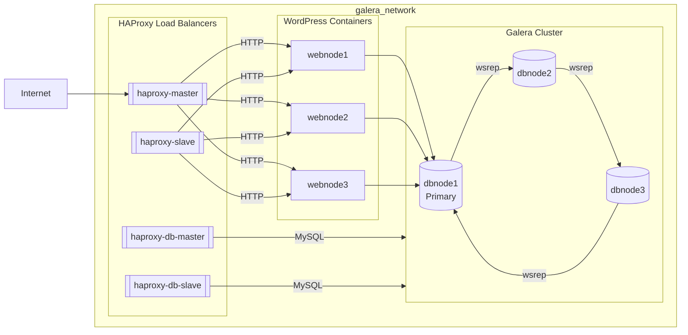
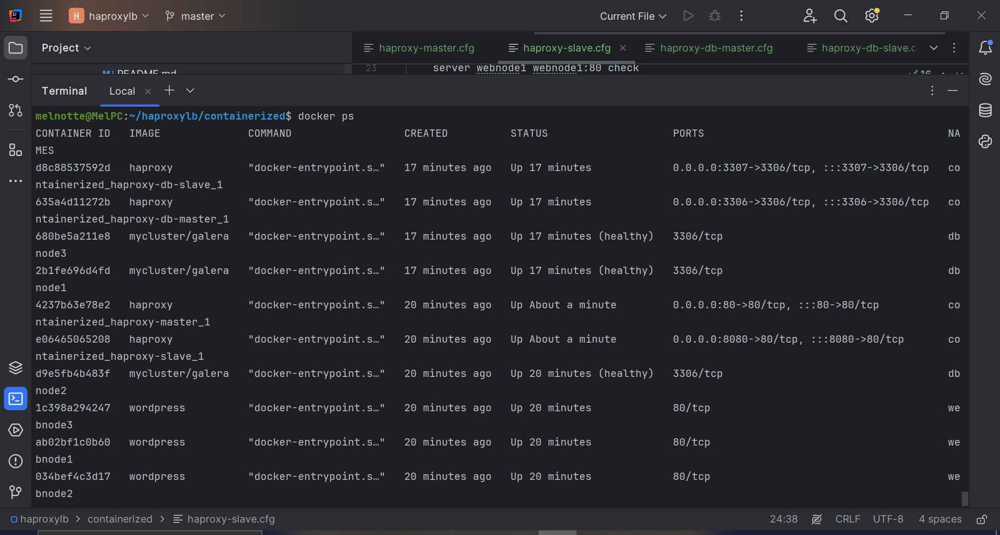
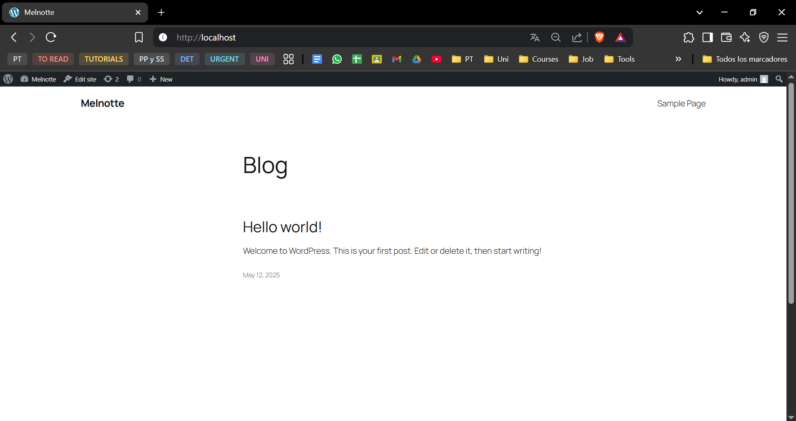

# Tarea #991 De la tarea #995 terminar de configurar la arquitectura completando el esquema de HA

#

## Composición de la Arquitectura de Alta Disponibilidad:

### **MariaDB (Galera Cluster)**

El clúster de bases de datos está compuesto por tres nodos (dbnode1, dbnode2, dbnode3), donde:
- **dbnode1** es el nodo primario.
- Todos los nodos están sincronizados utilizando el protocolo **wsrep** de **Galera**.

### **WordPress**

Existen tres contenedores de **WordPress**:
- **webnode1**, **webnode2**, **webnode3**.
- Cada nodo de WordPress se conecta a la base de datos MariaDB a través del nodo **dbnode1** dentro de la red **galera_network**.

### **HAProxy**

El sistema de balanceo de carga está compuesto por cuatro instancias de **HAProxy**:
1. **haproxy-master**: Balancea el tráfico **HTTP** entre los nodos de WordPress.
2. **haproxy-slave**: Actúa como respaldo del **haproxy-master**, balanceando también el tráfico **HTTP**.
3. **haproxy-db-master**: Balancea las conexiones **MySQL** entre los nodos del clúster de **MariaDB**.
4. **haproxy-db-slave**: Actúa como respaldo del **haproxy-db-master**, balanceando también las conexiones **MySQL**.

## Conexiones y Flujo de Datos

1. **Tráfico HTTP de los usuarios**:
   - Los usuarios acceden a **haproxy-master** o **haproxy-slave**.
   - Estos balanceadores de carga dirigen el tráfico hacia uno de los nodos de **WordPress** (webnode1, webnode2 o webnode3).

2. **Conexión de los nodos de WordPress a la base de datos**:
   - Los nodos de **WordPress** (wp1, wp2 y wp3) se conectan al nodo primario de **MariaDB (dbnode1)** a través de los balanceadores de carga **haproxy-db-master** y **haproxy-db-slave**.

3. **Balanceo de carga para las conexiones MySQL**:
   - **haproxy-db-master** y **haproxy-db-slave** gestionan el balanceo de las conexiones **MySQL** entre los nodos del clúster de **MariaDB**.

## Diagrama de la Arquitectura

## Herramientas de Prueba de Carga

- **Siege**
- **Apache Benchmark (ab)**

## Parámetros de la Prueba Siege

- **Usuarios simultáneos**: 10
- **Repeticiones**: 100
- **Duración**: 1 minuto

## Resultados

### Siege

| Métrica                        | Valor       |
|--------------------------------|-------------|
| Transacciones                  | 7,339       |
| Tiempo transcurrido            | 56.12 s     |
| Transacciones por segundo      | 130.77      |
| Tiempo de respuesta promedio   | 0.08 s      |
| Transacciones fallidas         | 0           |
| Concurrencia promedio          | 9.93        |
| Transferencia total            | 25.97 MB    |
| Transacción más larga          | 1.15 s      |

---

## Parámetros de la Prueba Apache Benchmark

- **Requests**: 1000
- **Concurrencia**: 10

### Resultados

| Métrica                        | Valor            |
|--------------------------------|------------------|
| Solicitudes completadas        | 1000             |
| Tiempo total de prueba         | 36.555 s         |
| Solicitudes por segundo        | 27.36 req/sec    |
| Tiempo por solicitud (media)   | 365.552 ms       |
| Transferencia total            | 49.86 MB         |
| Transferencia por segundo      | 1331.92 KB/s     |
| Tiempo máximo de solicitud     | 1902 ms          |
| Solicitudes fallidas           | 0                |

---

## Conclusiones
Las pruebas de carga con Siege y Apache Benchmark muestran que la infraestructura de HAProxy y MariaDB Galera Cluster maneja eficientemente cargas moderadas sin solicitudes fallidas. El tiempo de respuesta promedio con Siege fue de 0.08 segundos, indicando una alta eficiencia, aunque con Apache Benchmark se observó un aumento en el tiempo promedio de solicitud (365.552 ms), lo que sugiere una ligera caída en el rendimiento con cargas más intensivas. Aunque el sistema es confiable bajo condiciones de tráfico elevado, podría beneficiarse de ajustes en el tiempo de espera y la distribución de cargas en HAProxy para optimizar el rendimiento en escenarios de alta concurrencia.
